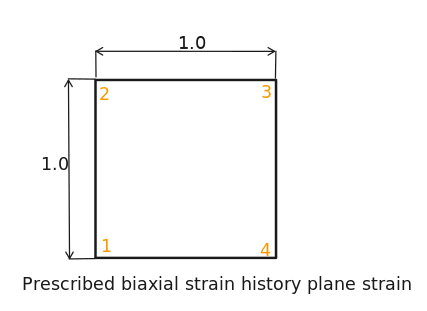

  # Model sketch
  
  # Benchmark purpose
  The objective of this benchmark is to evaluate the behavior of different solvers when dealing with a non-linear plasticity problem of a planar element. More specifically, the target effective stress will be evaluated for different boundary conditions, considering two plasticity hypothesis: perfect plasticity and isotropic hardening.
  The following table was extracted from the NAFEMS Publication NNB, Rev. 1, “NAFEMS Non-Linear Benchmarks,” October 1989, and contains the target values for each step of the resolution.
  # Material
  *  Linear elastic
  *  Young's modulus = 250 GPa
  *  Poisson's ratio = 0.25
  *  Yield stress = 5 MPa
  *  Strain at first yield = 0.25 x 10^-4
  *  Hardening modulus = 0 (perfect plasticity) or 62.5 GPa (isotropic hardening)
  # Boundary conditions and loads
  describe boundary conditions and loads
  # Mesh
  describe topology of mesh used in the study
  # Results
  provide benchmark results for tested codes
