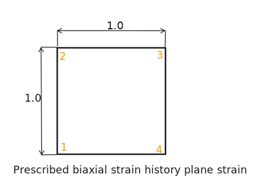
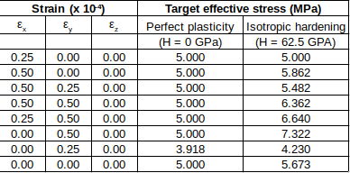

  # Model sketch
  
  
  # Benchmark purpose
  The objective of this benchmark is to evaluate the behavior of different solvers when dealing with a non-linear plasticity problem of a planar element. More specifically, the target effective stress will be evaluated for different boundary conditions, considering two plasticity hypothesis: perfect plasticity and isotropic hardening.
  
  The following table was extracted from the NAFEMS Publication NNB, Rev. 1, “NAFEMS Non-Linear Benchmarks,” October 1989, and contains the target values for each step of the resolution.
  
  
  
  # Material
  * Linear elastic
  * Young's modulus = 250 GPa
  * Poisson's ratio = 0.25
  * Yield stress = 5 MPa
  * Strain at first yield = 0.25 x 10^-4
  * Hardening modulus = 0 (perfect plasticity) or 62.5 GPa (isotropic hardening)
  
  # Boundary conditions
  Different boundary conditions are applied at each step of the simulation. 
  
  * Step 1:  at nodes 2 and 3
  * Step 2:  at nodes 2 and 3
  * Step 3:  at nodes 2 and 3,  at nodes 3 and 4
  * Step 4:  at nodes 2 and 3,  at nodes 3 and 4
  * Step 5:  at nodes 2 and 3,  at nodes 3 and 4
  * Step 6:  at nodes 3 and 4
  * Step 7:  at nodes 2 and 3
  * Step 8: all degrees of freedom contrained with zero displacement
  
  Unless stated otherwise, all degrees of freedom are constrained with zero displacement
  
  # Mesh
  describe topology of mesh used in the study
  
  # Results
  provide benchmark results for tested codes
